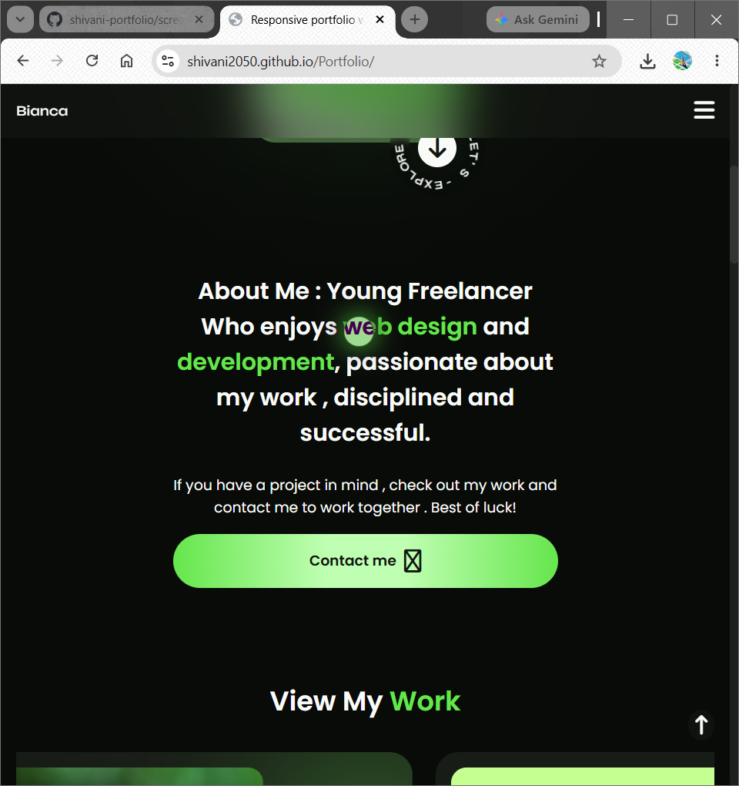

# portfolio

## MERN FULL STACK DEVELOPER

**Student:** shivani kumari
**Course:** Full Stack Web Development
**Batch:** 2026

## Project Description

This project is a web-based Porttfolio developed as part of the Frontend Web Development course at LetsLearnCoding.

## Technologies Used

* HTML
* CSS
* JavaScript

## Features

* Student Registration
* Student Login
* Attendance Management
* Attendance History
* Admin Dashboard

## Screenshots
![Home section].(screenshots/home.png)

![skills section].(screenshots/skills.png)
![what the say section].(screenshots/what-say.png)
![work section].(screenshots/work.png)
![services section].(screenshots/service.png)
![contact section].(screenshots/contact.png)
 

## Live Demo

Add the deployed project link here.

## GitHub Repository

Add the GitHub repository link here.

## Developed By

Rahul Kumar

## Training Institute

LetsLearnCoding
